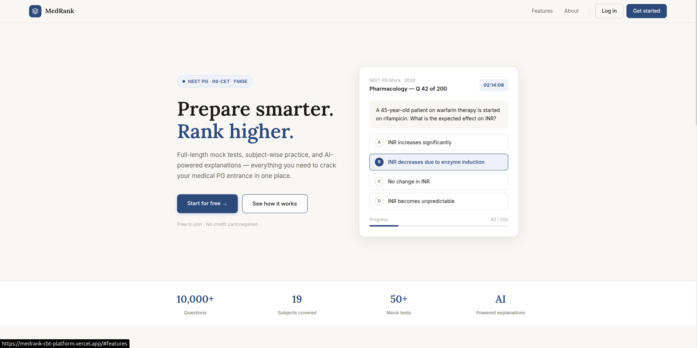
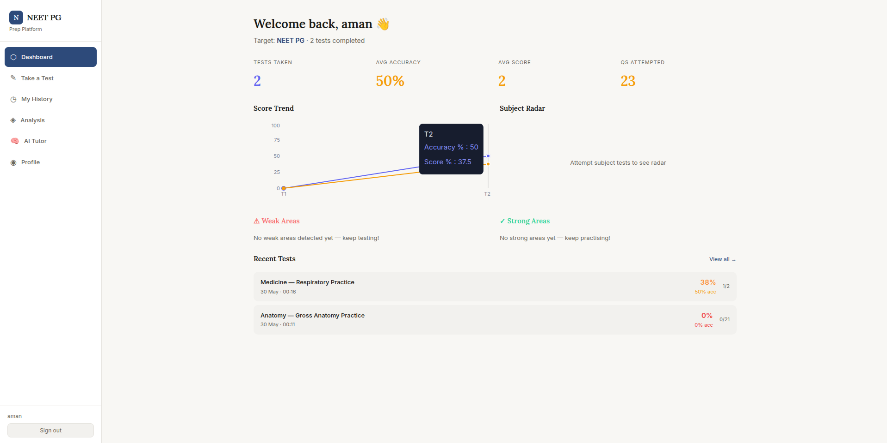
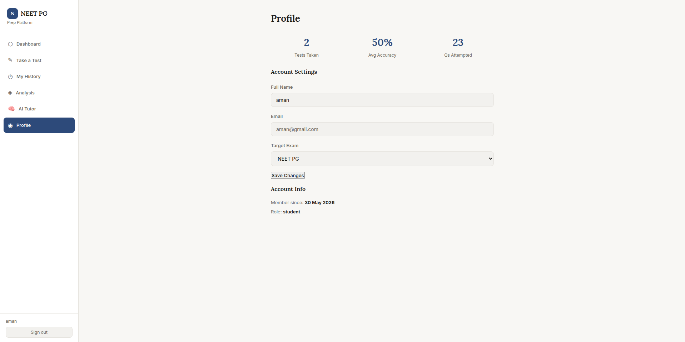
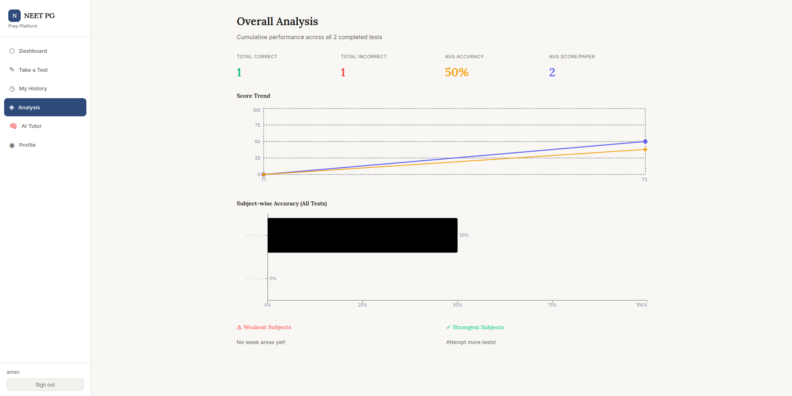

<div align="center">


# MedRank — Medical PG Exam Prep Platform

**A full-stack computer-based testing platform built for NEET PG, INI-CET, and FMGE aspirants.**  
Mock tests · Subject-wise practice · AI Tutor · Performance analytics

</div>

---

## Overview

MedRank is a production-grade CBT (Computer-Based Testing) platform that replicates the exact exam environment for Indian medical postgraduate entrance exams. Students get full-length mock tests, subject-wise drills, per-question reasoning analysis, and an AI tutor — all in one place.

**15,063 questions · 19 subjects · 176 exam papers**

---

## Screenshots






## Features

### Student Portal
- **CBT Exam Mode** — Exact NEET PG pattern with countdown timer, question palette, mark-for-review, and negative marking
- **3 Test Types** — Full mock papers (200 Qs), subject-wise tests, and topic-specific drills
- **Deep Analysis** — After every test: subject accuracy, topic rankings, difficulty breakdown, and a personalised focus plan
- **Cumulative Analytics** — Score trends and subject performance tracked across all tests over time
- **AI Tutor** — Multi-turn chat, deep clinical explanations, reasoning verification, and AI-generated test sessions

### Admin Panel
- Platform KPIs — total students, daily tests, active sessions, average accuracy
- Full student management — search, view, edit, delete with cascade
- Test session browser — filter by type, paper, or student
- Question bank editor — add, edit, delete questions across all 176 papers in-place
- Admin account management

---

## Tech Stack

| Layer | Technology |
|---|---|
| Frontend | React 18, Vite, Zustand, Recharts, React Router v6 |
| Backend | Node.js 18, Express 4, Mongoose 7 |
| Database | MongoDB Atlas |
| Auth | JWT + bcryptjs (cost factor 12) |
| AI | Anthropic Claude (claude-sonnet-4) |
| Deploy | Vercel (frontend) · Render (backend) |

---


## Getting Started

### Prerequisites
- Node.js 18+
- MongoDB Atlas account (free tier works)
- Anthropic API key (optional — only for AI Tutor features)

### 1. Clone the repo

```bash
git clone https://github.com/CoderRedwing/medrank-cbt-platform.git
cd medrank-cbt-platform
```

### 2. Set up the dataset

```bash
cp -r neet_pg_dataset/ backend/data/
# backend/data/neet_pg_dataset/_master_index.json must exist
```

### 3. Configure the backend

```bash
cd backend
cp .env.example .env
```

Edit `.env` with your values:

```env
MONGODB_URI=mongodb+srv://<user>:<pass>@cluster.mongodb.net/medrank
JWT_SECRET=your_64_char_random_string_here
JWT_EXPIRES_IN=7d
FRONTEND_URL=http://localhost:5173
ANTHROPIC_API_KEY=sk-ant-...   # optional
PORT=5000
NODE_ENV=development
```

### 4. Install and run

```bash
# Backend
cd backend
npm install
npm run seed:admin     # creates admin@neetpg.local / Admin@1234
npm run dev            # http://localhost:5000

# Frontend (new terminal)
cd frontend
npm install
npm run dev            # http://localhost:5173
```

---

## Environment Variables

| Variable | Required | Description |
|---|---|---|
| `MONGODB_URI`  | MongoDB Atlas connection string |
| `JWT_SECRET` | Random string, min 64 characters |
| `JWT_EXPIRES_IN` | Token expiry e.g. `7d` |
| `NODE_ENV`  | `development` or `production` |
| `FRONTEND_URL` | CORS allowed origin (no trailing slash) |
| `PORT` | Optional | API port, defaults to `5000` |
| `ANTHROPIC_API_KEY` | Optional | Required for AI Tutor features only |
| `DATASET_PATH` | Optional | Override default dataset directory |

---

## API Reference

### Auth `/api/auth`

| Method | Endpoint | Auth | Description |
|---|---|---|---|
| POST | `/register` | — | Register new student |
| POST | `/login` | — | Login, returns JWT |
| GET | `/me` | JWT | Get current user |
| PATCH | `/me` | JWT | Update name / target exam |
| POST | `/logout` | JWT | Revoke token |

### Tests `/api/tests`

| Method | Endpoint | Description |
|---|---|---|
| GET | `/papers` | List all available papers |
| POST | `/start` | Create a new test session |
| PATCH | `/:id/response` | Auto-save a question answer |
| POST | `/:id/submit` | Submit test and run analysis |
| GET | `/history` | Paginated test history |
| GET | `/:id/analysis` | Full analysis for a session |

### Dashboard `/api/dashboard`

| Method | Endpoint | Description |
|---|---|---|
| GET | `/` | Score trend, subject breakdown, recent tests |

### AI Tutor `/api/ai`

| Method | Endpoint | Description |
|---|---|---|
| POST | `/chat` | Multi-turn AI tutor conversation |
| POST | `/explain` | Deep clinical explanation of a question |
| POST | `/verify-reasoning` | Evaluate student's reasoning quality |
| POST | `/generate` | Generate MCQs for preview |
| POST | `/start-generated-test` | Generate and launch as live test session |

### Admin `/api/admin` *(admin role required)*

| Method | Endpoint | Description |
|---|---|---|
| GET | `/stats` | Platform KPIs and trend charts |
| GET | `/students` | Paginated student list with search |
| PATCH | `/students/:id` | Edit student profile |
| DELETE | `/students/:id` | Delete student and all test data |
| GET | `/tests` | All sessions, filterable |
| GET | `/papers` | List paper index |
| PATCH | `/papers/:type/:id/question` | Edit a question |
| POST | `/papers/:type/:id/question` | Add a question |
| DELETE | `/papers/:type/:id/question/:qid` | Delete a question |
| POST | `/create-admin` | Create admin account |

---

## Deployment

### Frontend → Vercel

```bash
cd frontend
npm run build
# Deploy dist/ to Vercel
# Set VITE_API_URL = https://your-backend.onrender.com/api
```

### Backend → Render

```
Root Directory:  backend
Build Command:   npm install
Start Command:   node src/server.js
```

Set all environment variables in the Render dashboard. Make sure `FRONTEND_URL` has **no trailing slash**.

---

## Default Credentials

After running `npm run seed:admin`:

| Role | Email | Password |
|---|---|---|
| Admin | admin@neetpg.local | Admin@1234 |

Change these immediately in production.

---

## Contributing

1. Fork the repository
2. Create a feature branch: `git checkout -b feature/your-feature`
3. Commit your changes: `git commit -m 'Add your feature'`
4. Push to the branch: `git push origin feature/your-feature`
5. Open a pull request

---

<div align="center">
  <sub>Built with care for India's medical PG aspirants.</sub>
</div>